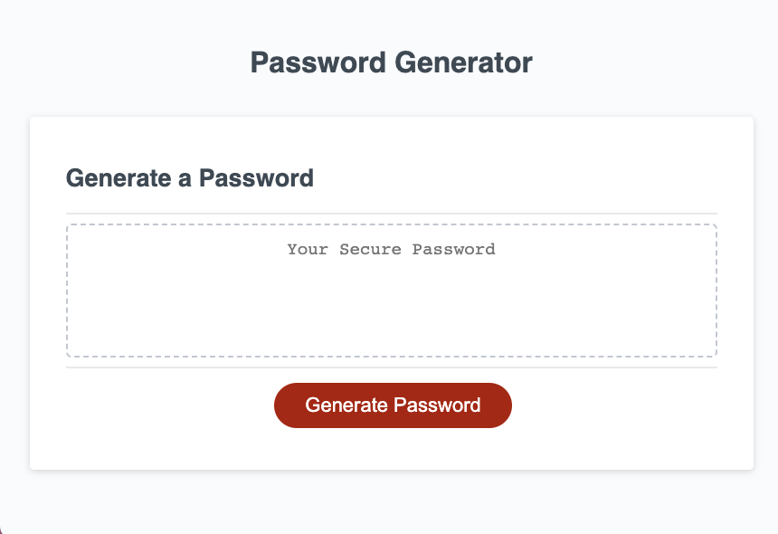
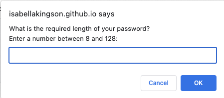
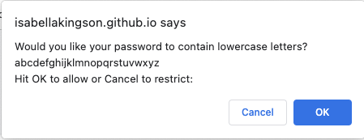
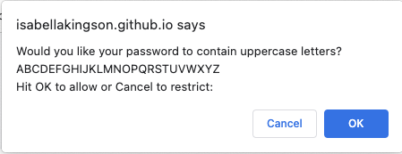
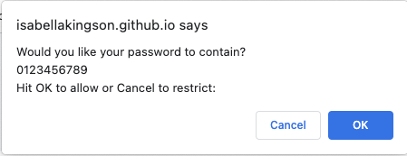
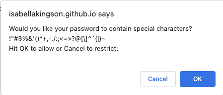

# Password Generator Starter Code

## Description

For almost everything we do on the web these days, you need a private and secure password. Creating a secure password that won't be easily guessed by bad actors can be difficult, and this program aims to automate the process for password generation.

Through this process I learned how to implement some of the basics of JavaScript such as creating variables, functions, if statements, and for loops. I also learned about the scope of variables, data typess, and the methods that can be used to alter them.

## Installation

To use this application, simply follow the link, or copy and paste it into your web browser: https://isabellakingson.github.io/password-generator/.

## Usage

To use this program, click the generate password button and follow the prompts to enter your password criteria.

The application will generate your secure password, which you can then copy and paste to where you need it.

## Credits

The original starter code came from Xander Rapstine: https://github.com/Xandromus.
This is where you can find the starter code: https://github.com/coding-boot-camp/friendly-parakeet.

I had help from my tutor: Alistair Rowden.

I used this source to learn how to generate a random string using JavaScript: https://tecadmin.net/generate-random-string-in-javascript/.

## Tests

Their are a few tests you can run to see this application's functionality.

First, try entering a string that is not a number when prompted for the desired length of your password. You should see that this is not accepted and the apllication will prompt you to enter a valid number.

Next, try entering a number less than 8 or greater than 128. Again, you should see that this is not accepted and the application will ask you to enter a valid number.

Finally, try not selecting any of the possible criteria (lowercase letters, uppercase letters, numbers, or special characters) for your password by hitting cancel on each prompt following the length prompt. You should see that the applicaton will not allow this and will send you back to the beginning of the function to try again.

You can see that the application guides the user to get the desired result.
